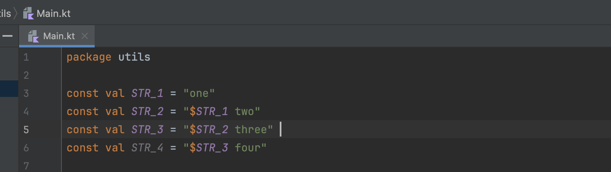
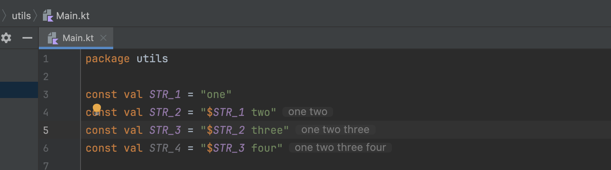
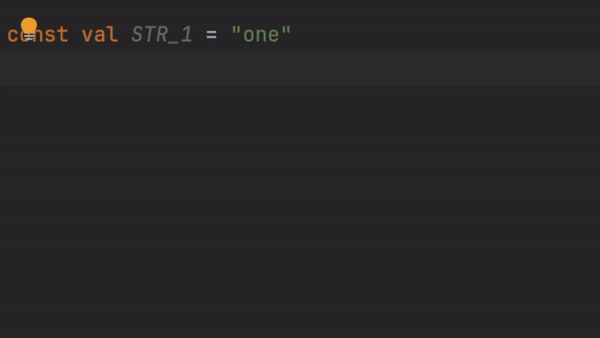
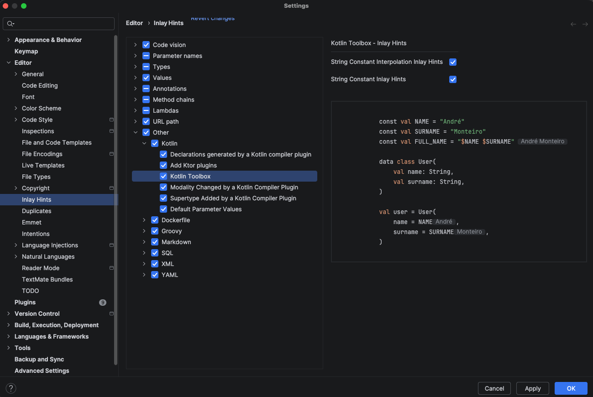

# Kotlin Inlay Hints

**Kotlin Inlay Hints** display computed values of string interpolations and constants directly inline in your code, making it easier to understand what your code does without having to run it.

---

## What are Inlay Hints?

Inlay Hints are small visual annotations that appear directly in the code editor, showing additional information without modifying the source code.

The plugin adds hints for:

- **String Interpolation** - Shows the computed value of interpolations
- **Constant Values** - Displays resolved constant values

---

## How They Work

### String Interpolation Hints

When you have a string with interpolation, the plugin calculates and shows the resulting value:

**Without Inlay Hints:**

<div class="grid" markdown>

</div>

**With Inlay Hints:**

<div class="grid" markdown>

</div>

### Constant Value Hints

For constant values, the plugin resolves and shows the final value:

<div style="text-align: center;" markdown="1">

{ .skip-lightbox }

</div>

---

## Enabling / Disabling

### Enable Hints

By default, inlay hints are **enabled** after installing the plugin. If you need to enable them manually:



1. Go to **Settings/Preferences** → **Editor** → **Inlay Hints** → **Other** → **Kotlin**
2. Look for **Kotlin Toolbox**
3. Check the options:
   - ☑ **String interpolation values**
   - ☑ **Constant string values**

### Temporarily Disable

To temporarily disable hints without uninstalling the plugin:

1. Access the same settings above
2. Uncheck the desired options
3. Hints will disappear immediately

---

## Compatibility

### K2 Mode

!!! success "Fully Compatible"
    The plugin is **fully compatible** with the new Kotlin K2 compiler.

Inlay hints work perfectly in both K1 (classic) and K2 modes:

- ✅ Kotlin K1 (Classic Compiler)
- ✅ Kotlin K2 (New Compiler)

### Kotlin Versions

Hints work with all modern versions of Kotlin:

- ✅ Kotlin 1.9+
- ✅ Kotlin 2.0+
- ✅ Kotlin 2.1+

### IntelliJ IDEA

Requires:

- ✅ IntelliJ IDEA 2025.3.2 or later
- ✅ Kotlin plugin enabled

---

## Known Limitations

!!! info "Current Limitations"
    Inlay hints work best with:

    - ✅ Compile-time constant values
    - ✅ String literals
    - ✅ Simple interpolations
    - ✅ Constant expressions

    They do not work with:

    - ❌ Runtime-computed values
    - ❌ Results of non-const functions
    - ❌ Uninitialized mutable variables

### Limitation Example

```kotlin
fun getUserName(): String = "Alice"

val greeting = "Hello, ${getUserName()}"
// Hint will not be shown because getUserName() is executed at runtime
```

---

## Performance

!!! success "Lightweight and Fast"
    Inlay hints are calculated **asynchronously** and do not impact IDE performance:

    - Do not affect typing speed
    - Do not block the interface
    - Update automatically as you edit code
    - Smart caching for optimization

---

## Troubleshooting

### Hints not showing

1. Check that the feature is enabled:
   - **Settings** → **Editor** → **Inlay Hints** → **Other** → **Kotlin** → **Kotlin toolbox**
   - Make sure the options are checked

2. Check that the code is eligible:
   - Only constant values are supported
   - Interpolations must be resolvable at compile time

3. Restart the IDE if necessary

### Hints are cluttering the view

- Adjust opacity in the theme settings
- Configure to show only on hover
- Temporarily disable when not needed

---

<div style="text-align: center;" markdown="1">

**Explore more features!**

[JWT Encoder/Decoder](jwt-encoder-decoder.md){ .md-button }

</div>
